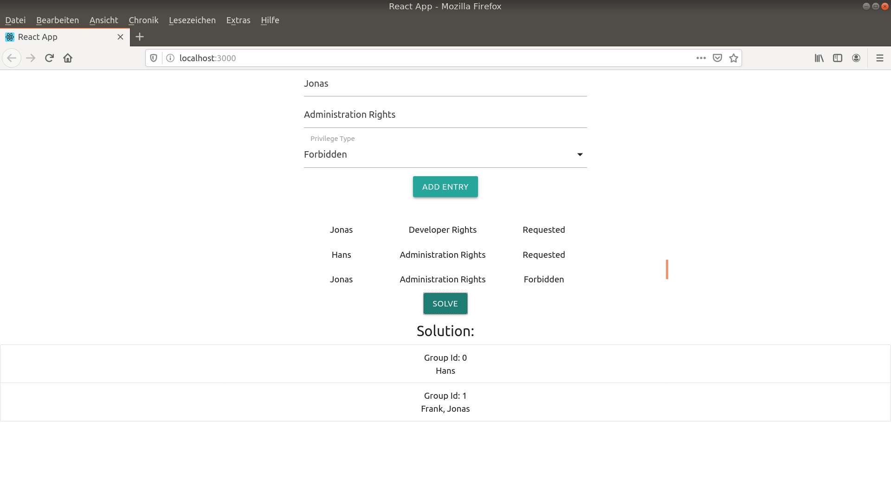

# user-privilege-scheduler-ui
Example UI for the user-privilege-scheduler

# Description

The following project presents an example of how a client for one of the previous projects:
https://github.com/DucTuLeAnh/user-privilege-scheduler
can look like. React.js and materialize css where used in this repository.

